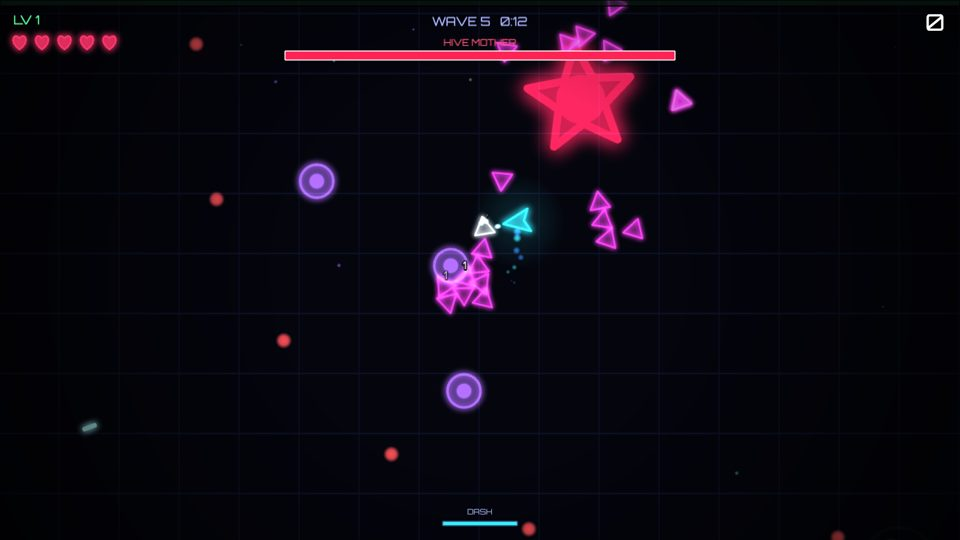
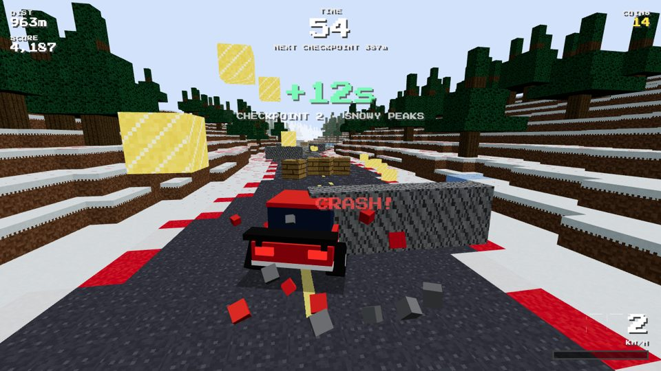
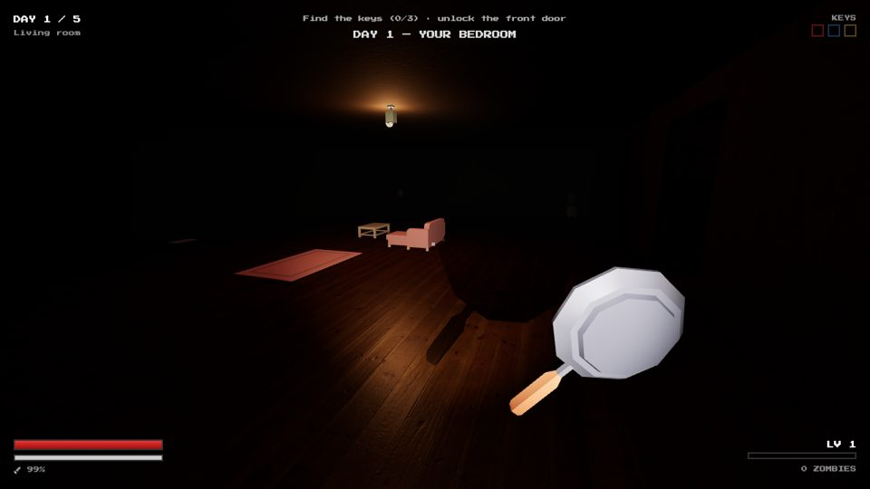
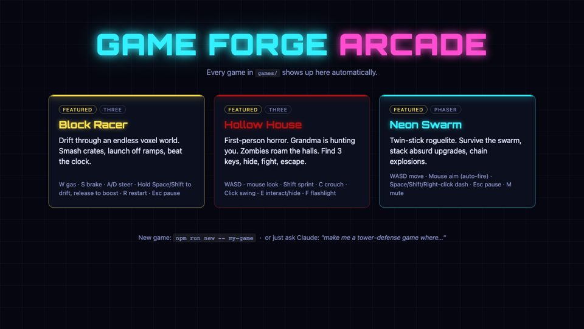
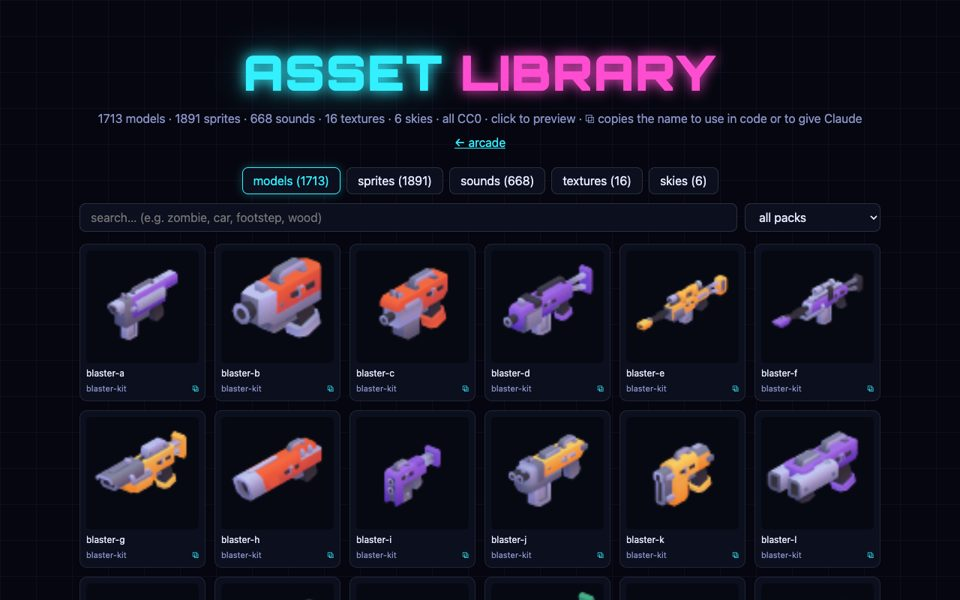

# Game Forge

**Vibe-code browser games with Claude Code.** Describe a game in plain English, and Claude builds it, playtests it headlessly, and hands you something playable in a single session.

Everything is set up for an AI agent to work fast: a shared game kit (juice, procedural art & sound, menus, AI helpers), six genre templates that already play, a headless bot that plays your game and screenshots it, and instructions (`AGENTS.md` / `CLAUDE.md` / skills) that teach the agent how to use all of it.

| | |
|---|---|
|  |  |
| **Neon Swarm** — twin-stick roguelite (2D, Phaser) | **Block Racer** — voxel drift racer (3D, Three.js) |
|  |  |
| **Hollow House** — first-person horror (3D, Three.js) | **The arcade** — every game you make shows up here |

All games were built by Claude in this repo from short prompts, using the shared kit and the CC0 asset library below.

## Asset library



**~1,700 3D models · ~1,900 sprites · ~670 sounds · 16 photoreal textures · 6 HDRI skies**, all CC0 (free for commercial use, no attribution required) — from [Kenney](https://kenney.nl) and [Poly Haven](https://polyhaven.com). Animated characters (walk, run, shoot, kick, die…), zombies and skeletons, cars, guns, furniture, nature, castles, space, food, dungeons, platformer tiles, UI, icons, footsteps, impacts, lasers, explosions, door creaks, an announcer voice, and more.

- Browse it at **`/assets.html`** (link on the arcade page): search, spin models in 3D, play their animations, listen to sounds, copy names.
- Claude reads `assets/CATALOG.md` and uses the library automatically when it builds a game.
- Need something else? `npm run assets -- add <kenney-pack>` or `npm run assets -- texture <polyhaven-id>` pulls it in, ready to use.

## Quick start

Requires **Node 20.19+** and, for the AI workflow, **[Claude Code](https://claude.com/claude-code)** (CLI, VS Code or JetBrains extension, or desktop app).

```bash
git clone https://github.com/npmiaman/game-forge.git
cd game-forge
npm run setup          # installs dependencies + headless Chromium for playtests
npm run dev            # opens the arcade at http://localhost:5173
```

Then open the folder in Claude Code and say what you want:

> *make a game where you're a bee defending a hive from wasps, with roguelite upgrades*

Claude picks the closest template, scaffolds `games/<your-game>/`, builds it, bot-playtests it, reads the screenshots, fixes what's broken, and tells you how to play it.

## The vibe-coding loop

1. **Describe it.** Any genre: shooter, platformer, puzzle, physics, racing, 3D, horror…
2. **Play it.** `npm run play -- <slug>` opens it with hot reload.
3. **Tune it live.** Add `?tune` to the URL for sliders on every gameplay number. Hit *Copy values* and paste them back to Claude.
4. **Iterate in plain words.** *"enemies feel floaty"*, *"add a boss at wave 5"*, *"make the jump snappier"*.
5. **Polish & ship.** `/polish <slug>` runs a game-feel pass; `/ship <slug>` makes an itch.io-ready zip.

Each game keeps a `GAME.md` design doc that Claude reads and updates, so you can come back days later and say *"continue the bee game"*.

### Claude Code commands

| Command | What it does |
|---|---|
| *"make me a … game"* | `make-game` skill: design → scaffold → build → playtest → hand-off |
| `/playtest <slug>` | bot-plays the game, reads screenshots, fixes what's broken |
| `/polish <slug>` | walks the game-feel checklist and adds missing juice |
| `/ship <slug>` | checks, builds, and zips the game for itch.io |

A hook type-checks after every edit Claude makes and feeds errors straight back, so broken code never piles up.

## Commands

| | |
|---|---|
| `npm run new` | list templates and existing games |
| `npm run new -- my-game --template topdown` | new game from a template |
| `npm run new -- my-game --from neon-swarm` | remix an existing game |
| `npm run play -- my-game [god&tune]` | dev server + open the game |
| `npm run shot -- my-game --gpu` | headless bot playtest → screenshots in `.shots/` |
| `npm run check` | type-check everything (~1 s) |
| `npm run ship -- my-game` | standalone build + `ship/my-game.zip` |
| `npm run assets -- add castle-kit` | import any Kenney pack (also `texture` / `hdri <polyhaven-id>`) |
| `npm run build` | the whole arcade as a static site in `dist/` |

VS Code users: **Tasks: Run Task** has all of these, and **F5** debugs a game in Chrome with breakpoints.

## Templates

| Template | Start here for |
|---|---|
| `blank` | anything 2D that fits nothing below |
| `topdown` | shooters, survivors-likes, lots of enemies, level-up cards |
| `platformer` | platformers, side-scrollers (coyote time, ASCII levels) |
| `puzzle` | grid / turn-based / logic games (Sokoban with undo) |
| `physics` | real rigid bodies: slingshots, stacking, golf (Matter.js) |
| `3d` | anything 3D (Three.js with bloom and HTML HUD) |

Every template is a complete, playtested game — menus, pause, game over, best score, sound and juice included.

## What's inside

```
assets/         CC0 asset library (models, sprites, sounds, textures, skies) + CATALOG.md
kit/            shared game kit — every file's header comment is its docs
  audio.ts        procedural SFX presets (ZzFX) + chiptune/synthwave music sequencer
  tune.ts         live tuning sliders (?tune)
  director.ts     wave / spawn budgeting      upgrades.ts   roguelite "pick 1 of 3"
  grid.ts         A* pathfinding, flood fill  fsm.ts        state machines
  pool.ts · spatial.ts · rng.ts · save.ts · math.ts · input.ts
  phaser/         boot, menus, pause, upgrade cards, procedural textures, juice, UI, touch
  three/          boot (renderer, bloom, shadows, HUD, shake), cube debris
  assets.ts       load library models/animations/textures/skies/sounds by name
templates/      six genre starters
games/          your games (each: index.html, main.ts, game.json, GAME.md)
scripts/        new-game, play, shot (headless playtest), ship, assets (importer)
.claude/        skills (make-game, playtest, polish, ship, phaser4) + type-check hook
AGENTS.md       instructions for any coding agent (CLAUDE.md imports it)
```

**Stack:** Phaser 4 · Three.js · Vite · TypeScript · ZzFX · Tweakpane · Playwright.

## Using other AI agents

`AGENTS.md` holds the project instructions in the cross-agent format (Codex, Cursor, Gemini CLI, etc. read it). The build procedure lives in `.claude/skills/make-game/SKILL.md` — plain Markdown any agent can follow. Claude Code gets the extras: auto-loaded skills, slash commands, and the type-check hook.

## Publishing a game

`npm run ship -- my-game` → upload `ship/my-game.zip` to [itch.io](https://itch.io) as an HTML game (tick *"played in the browser"*, viewport 1280×720), or drag `ship/my-game/` onto [Netlify Drop](https://app.netlify.com/drop).

## Credits & license

Code: MIT — see [LICENSE](LICENSE). Assets: CC0 — see [assets/LICENSES.md](assets/LICENSES.md) (Kenney, Poly Haven). Built on [Phaser](https://github.com/phaserjs/phaser) (MIT), [three.js](https://github.com/mrdoob/three.js) (MIT), [ZzFX](https://github.com/KilledByAPixel/ZzFX) (MIT), [Tweakpane](https://github.com/cocopon/tweakpane) (MIT), and the Orbitron & Press Start 2P fonts (OFL) via [Fontsource](https://fontsource.org).
